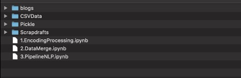
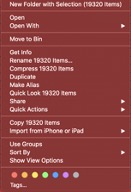
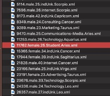
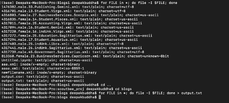

# **Introduction**

Hi Reader,

This report is going to be a very brief explanation of how I went
through with the process of designing a search and ranking system for
query matching. (For step by step explanation, check jupyter notebooks
for markdowns and comments)

## Layout of my Repo

On extracting the my repo, the contents of the folder look as follows

-   **blogs** - extracted version of BlogCorpus data

-   **CSVData** - contains DataFrames (mainly from converting csv files
    > in blog folder to dataframes)

-   **Pickle** - consists of exported TF-IDF vectorizer and vocabulary
    > of blogs

-   **Scrapdrafts** - Drafts or models of my code. Most/nearly all are
    > scrap. Uploaded it for reference. Can ignore it for the most part.

-   Jupyter Notebooks:

    -   1\. **EncodingProcessing**: converting csv files based on
        > encoding to separate dataframes.

    -   2.**DataMerge**: merging all dataframes from jupyter notebook
        > into a single large file

    -   3.**PipelineNLP**: As the name suggests, this is where our NLP
        > pipeline is initiated.

For this project, I have used **[TF-IDF Vectorizer and Cosine
Similarity]{.ul}** while also utilizing **[Spacy library to check for
query search similarities]{.ul}**.

**Note**: Only the Data Preprocessing part is explained in detail in
this report. For the whole picture, do check the jupyter notebook in the
order it is listed. I have explained each step of the process with
markdowns and comments.

## Data Preprocessing and Import

On extracting the BlogCorpus dataset provided, below are the summary
points of my initial analysis of dataset

-   There are a total of 19320 files in xml format.

-   Each filename has the following attributes of that particular
    > blogger:

    -   Id

    -   Gender

    -   Age

    -   Profession

    -   Astrological Sign

-   The contents of each file has the following tags in the formatting
    > provided:

    -   Blog

        -   Date

        -   Post

        -   Date

        -   Post

        -   ...

[Medium of implementation]{.ul}: Jupyter Notebook

The **plan of attack** was to:

1.  use the .glob library to import all filenames

2.  filter the different fields from the filename, and

3.  get the *(date, post)* combinations of that particular file

Initially I tried to use xml.etree.ElementTree library to open and parse
the file.\
[Problem]{.ul}: Wasn\'t able to import more than one file because I was
either getting *unable to parse* or *utf-8 codec* error. In most cases
the parser seems to fail for an unknown reason.

[Solution steps]{.ul}:

-   After spending considerable time on it, I came to realise that due
    > to different encodings of most files, xml.ElementTree was unsuited
    > to import files with encodings other than utf-8.

-   I tried to convert files from other encodings to ascii encoding and
    > then to utf-8 but that compromised the accuracy of the text
    > inside. So this method wasn't used either.

-   **Actual solution**:

    a.  Get the encodings of all files and store it as output .txt
        > file.\
        > *(below is an image of the terminal code)*

b.  Take the output.txt file as input to my first jupyter notebook (
    > **EncodingProcessing.ipynb**) and process it there.

**Further processing and explanations for the rest of the process are
provided in the jupyter notebooks (in the order in which they are
named).**

**Conclusions are also provided in the last section of the final
Notebook to provide context and clarity to the reader.**
